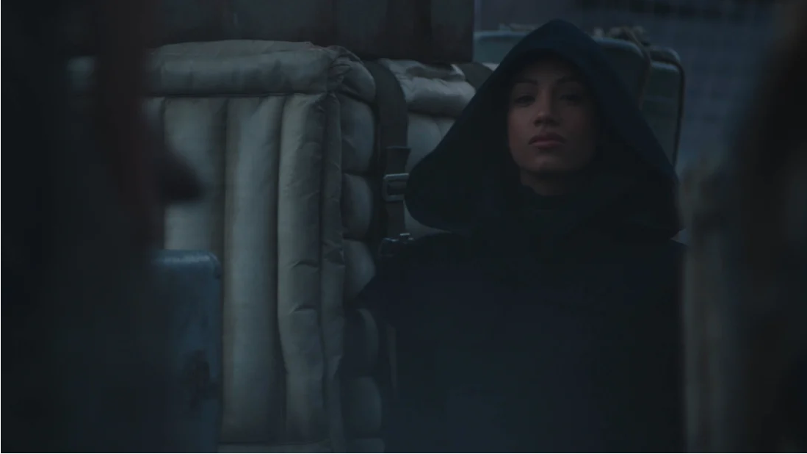

# Who Is the Mysterious Hooded Figure In the New The Mandalorian Trailer?

There are lots of great scenes in there, from the Razor Crest flying alongside X-Wings to Baby Yoda encasing himself in his little floating pram while Mando Daddy Din Djarin (Pedro Pascal) takes care of some bad guys.

But the trailer also leaves viewers with plenty of questions. For instance, the first season ended with Mando deciding to travel the galaxy with Baby Yoda looking for his people, whom we have never met in the history of the Star Wars saga. But according to the conversation between Mando and the Armorer (Emily Swallow), it sounds like Mando is actually going to deliver the Child to the Jedi—or at least what’s left of them.

“The songs of eons past tell of battles between Mandalore The Great, and an order of sorcerers called Jedi that fought with such powers,” the Armorer says. “You expect me to search the galaxy and deliver this creature to a race of enemy sorcerers?” Mando fires back.

It’s interesting to hear the Jedi described as “enemy sorcerers,” but it’s true that the Mandalorians did fight against the Jedi in times of old, so it's not all that surprising that they don’t have the best relationship. What's also important to remember is that at the time The Mandalorian is set—which is after Return of the Jedi but before The Force Awakens—there aren’t many Jedi left in the galaxy, so Mando’s search will be tricky indeed.

But do we see one in the trailer? Right as Mando and the Armorer are having their conversation, we see a hooded figure appear in the midst of a crowded city, and as people walk in front of her, she suddenly vanishes.

It definitely seems like a Jedi thing to do. Plus, it has been rumored that a beloved Jedi character will show up in The Mandalorian: Ahsoka Tano, a character from Star Wars: The Clone Wars and Star Wars Rebels (two other series that have been overseen by The Mandalorian showrunner Dave Filoni) who trained under none other than Anakin Skywalker. (Technically she never finished her training, but we’ll let that slide.) The longtime rumor has been that Rosario Dawson would be taking on the role of Ahsoka in The Mandalorian, but Disney has never confirmed that. So, could this figure be Ahsoka?

Well, probably not, as Ahsoka has orange skin, white facial markings, and a very distinctive blue-and-white striped headpiece that turns into points above her head and flows down in front of her shoulders like braids. However, fans think the figure could be Sabine Wren, an associate of Ahsoka’s, who has also been rumored to appear in The Mandalorian.

Sabine Wren, another character from Star Wars Rebels, is a Mandalorian warrior who helped free her home planet of Mandalore from the grip of the Empire during the Mandalorian Civil War, during the events of the original trilogy. At the end of Star Wars Rebels, she and Ahsoka took off together to find their friend Ezra Bridger, who had vanished into the far reaches of space. Might they cross paths with Mando and Baby Yoda during their search?

If they do, the episode could serve as a backdoor pilot for an Ahsoka Tano show, which has also been heavily rumored. But bringing Ahsoka and Sabine into The Mandalorian wouldn’t just be about building out a new Star Wars TV universe; these two could help Mando on his quest. If he’s looking for the Jedi, Ahsoka might know where to find some. As for Sabine: She has wielded the Darksaber, an ancient Mandalorian weapon now possessed by the vile Moff Gideon, who surely did not come by it honestly. Mando could use all the intel he can get about that weapon before he has to face Moff Gideon in battle.

Whoever the character is, she is being played by professional wrestler Sasha Banks, whose IMDb page confirms her appearance in The Mandalorian's season 2 (though no character name is given). We’ll find out more when The Mandalorian's second season premieres on Disney+ on October 30, 2020.

